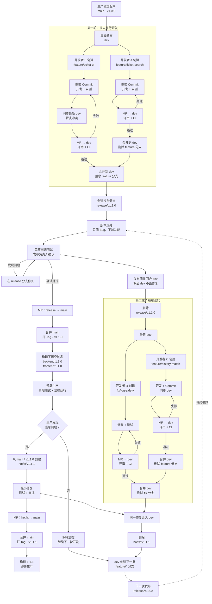

# 中科融道 GitLab 开发与发布流程规范

## 目录

- [1. 流程概览](#1-流程概览)
  - [1.1 目的](#11-目的)
  - [1.2 完整流程图](#12-完整流程图)
  - [1.3 分支与 Tag 职责](#13-分支与-tag-职责)
- [2. 日常开发与协作](#2-日常开发与协作)
  - [2.1 日常功能开发流程](#21-日常功能开发流程)
  - [2.2 多人开发同一个需求](#22-多人开发同一个需求)
- [3. 发布与紧急修复](#3-发布与紧急修复)
  - [3.1 正式版本发布流程](#31-正式版本发布流程)
  - [3.2 生产紧急修复流程](#32-生产紧急修复流程)
  - [3.3 版本号规则](#33-版本号规则)
- [4. 仓库治理](#4-仓库治理)
  - [4.1 GitLab 仓库保护规则](#41-gitlab-仓库保护规则)
  - [4.2 必须遵守的团队规则](#42-必须遵守的团队规则)
- [5. 操作速查与流程总结](#5-操作速查与流程总结)
  - [5.1 高频操作速查](#51-高频操作速查)
  - [5.2 流程总结](#52-流程总结)

## 1. 流程概览

### 1.1 目的

本文档规定项目从功能开发、代码合并、版本发布、生产部署到后续持续迭代的标准 Git 协作流程，主要目标是：

- 隔离不同开发任务，减少多人协作时的相互影响。
- 通过 Merge Request（MR）、代码审查和 CI 保证合入质量。
- 保证每个生产版本可识别、可追踪、可复现、可回滚。
- 明确普通功能、版本发布和生产紧急修复的不同处理方式。
- 及时删除已完成的短生命周期分支，保持仓库整洁。

本项目采用轻量化 Git Flow：

- `main`：生产稳定主线。
- `dev`：日常开发集成主线。
- `feature/*`、`fix/*`：个人或小组的短生命周期开发分支。
- `release/*`：版本发布准备分支。
- `hotfix/*`：生产紧急修复分支。
- `vX.Y.Z`：正式发布版本 Tag。

### 1.2 完整流程图



### 1.3 分支与 Tag 职责

| 分支或 Tag | 作用 | 来源 | 合并目标 | 生命周期 |
|---|---|---|---|---|
| `main` | 保存已发布或随时可发布的生产稳定代码 | 长期分支 | 不适用 | 永久保留 |
| `dev` | 汇总已经完成评审的日常开发成果 | 通常由 `main` 初始化 | 发布时经 `release/*` 进入 `main` | 永久保留 |
| `feature/*` | 开发一个独立功能 | 最新 `dev` | `dev` | MR 合并后删除 |
| `fix/*` | 修复尚未发布的普通缺陷 | 最新 `dev` | `dev` | MR 合并后删除 |
| `release/vX.Y.Z` | 版本冻结、回归测试和发布准备 | 最新 `dev` | `main`；发布修复同时回流 `dev` | 发布完成后删除 |
| `hotfix/vX.Y.Z` | 修复生产环境紧急问题 | 当前生产对应的 `main` 或 Tag | 同时合入 `main` 和 `dev` | 热修复发布后删除 |
| `vX.Y.Z` | 固定一个正式发布版本 | `main` 的发布提交 | 不合并 | 永久保留，禁止移动 |

删除已经合并的分支只会删除分支指针，不会删除已经进入 `dev`、`main` 或 Tag 的 Commit。

## 2. 日常开发与协作

### 2.1 日常功能开发流程

#### 2.1.1 同步集成分支

开始新任务前，先取得远程最新代码：

```bash
git fetch origin
git switch dev
git pull --ff-only origin dev
```

#### 2.1.2 创建任务分支

新功能：

```bash
git switch -c feature/history-ticket
git push -u origin feature/history-ticket
```

普通缺陷：

```bash
git switch -c fix/history-query-timeout
git push -u origin fix/history-query-timeout
```

分支名称应简短表达任务，不使用个人姓名、`test`、`new` 等含义模糊的名称。

#### 2.1.3 开发并提交

一个 Commit 应只处理一个相对完整的变化：

```bash
git add <本次修改涉及的文件>
git commit -m "feat(history): 增加历史工作票查询接口"
git push
```

推荐 Commit 类型：

| 类型 | 用途 |
|---|---|
| `feat` | 新功能 |
| `fix` | 缺陷修复 |
| `refactor` | 不改变外部行为的代码重构 |
| `test` | 测试代码 |
| `docs` | 文档 |
| `chore` | 构建、依赖、工具等维护工作 |
| `ci` | CI/CD 配置 |

禁止把密码、Token、生产 `.env`、临时压缩包或无关文件放入 Commit。

#### 2.1.4 合并前同步 `dev`

准备提交 MR 前，必须同步最新 `dev`，尽早发现冲突：

```bash
git fetch origin
git merge origin/dev
```

熟悉 rebase 的开发者也可以在个人分支使用：

```bash
git fetch origin
git rebase origin/dev
git push --force-with-lease
```

`--force-with-lease` 只能用于自己的短生命周期分支，禁止对 `dev`、`main`、`release/*` 使用。

#### 2.1.5 创建 Merge Request

MR 目标分支为：

```text
feature/* 或 fix/* → dev
```

MR 描述至少包含：

- 需求或问题背景。
- 修改内容。
- 测试方法与测试结果。
- 是否涉及数据库 migration。
- 是否新增或修改配置项。
- 兼容性、部署和回滚风险。
- 前端变化截图（如适用）。

#### 2.1.6 审查、CI、合并和删除

只有同时满足以下条件才能合并：

- CI 全部通过。
- 至少一名非作者成员完成代码审查。
- MR 中的讨论已经解决。
- 分支已同步目标分支，不存在冲突。
- 功能达到任务验收标准。

合并后删除远程任务分支，并清理本地分支：

```bash
git switch dev
git pull --ff-only origin dev
git branch -d feature/history-ticket
git fetch --prune origin
```

随后从最新 `dev` 创建下一个任务分支，进入下一轮开发。

### 2.2 多人开发同一个需求

较大需求使用“公共需求分支 + 个人子分支”：

```text
dev
└── feature/history-ticket
    ├── feature/history-ticket-api
    ├── feature/history-ticket-ui
    └── feature/history-ticket-model
```

协作规则：

1. 需求负责人从 `dev` 创建公共需求分支。
2. 每位开发者从公共需求分支创建自己的子分支。
3. 个人子分支通过 MR 合入公共需求分支。
4. 公共需求分支完成集成测试后，通过一个总 MR 合入 `dev`。
5. 总 MR 合并后删除公共需求分支和所有个人子分支。

不建议多人长期直接 push 同一分支。确需共用分支时，推送前必须执行：

```bash
git pull --rebase origin <共享分支>
git push origin <共享分支>
```

共享分支禁止强推，并应提前划分文件和模块责任边界。

## 3. 发布与紧急修复

### 3.1 正式版本发布流程

#### 3.1.1 发布冻结

确定发布范围后，从最新 `dev` 创建发布分支：

```bash
git fetch origin
git switch dev
git pull --ff-only origin dev
git switch -c release/v1.1.0
git push -u origin release/v1.1.0
```

发布分支创建后：

- 不再加入新功能。
- 只允许修复阻断发布的问题。
- 更新版本号和 `CHANGELOG.md`。
- 完成后端测试、前端测试、构建、数据库 migration 和完整业务回归。

#### 3.1.2 合并 `main` 并打 Tag

完整回归测试和发布负责人确认通过后创建 MR：

```text
release/v1.1.0 → main
```

合并完成后，在 `main` 对应发布提交创建附注 Tag：

```bash
git fetch origin
git switch main
git pull --ff-only origin main
git tag -a v1.1.0 -m "Release v1.1.0"
git push origin v1.1.0
```

Tag 必须指向实际用于构建和部署的 Commit，禁止发布后移动或覆盖同名 Tag。

#### 3.1.3 构建与部署

正式制品使用不可变版本号：

```text
workticket-backend:1.1.0
workticket-frontend:1.1.0
```

禁止仅依赖 `latest` 判断生产版本。正式部署应遵循：

```text
Git Tag
→ 构建一次不可变制品
→ 生产部署该制品
→ 冒烟测试
→ 监控
```

生产发布前必须准备数据库备份、上一版本制品、当前配置备份、发布清单和回滚方案。

#### 3.1.4 发布修复回流 `dev`

如果发布分支中产生了修复，这些修复必须回流 `dev`。可以创建 MR：

```text
release/v1.1.0 → dev
```

确认 `main` 与 `dev` 都包含发布修复后，删除 `release/v1.1.0`。

### 3.2 生产紧急修复流程

生产紧急问题从当前生产版本创建 `hotfix/*`，不能从包含未发布功能的 `dev` 创建：

```bash
git fetch origin
git switch main
git pull --ff-only origin main
git switch -c hotfix/v1.1.1
git push -u origin hotfix/v1.1.1
```

热修复要求：

- 修改范围尽可能小。
- 增加能够复现问题的回归测试。
- 完成代码审查和 CI。
- 验证部署与回滚方案。

修复完成后分别创建 MR：

```text
hotfix/v1.1.1 → main
hotfix/v1.1.1 → dev
```

`main` 合并完成后打 `v1.1.1` Tag、构建制品并部署生产。确认 `main` 与 `dev` 都包含修复后，删除热修复分支。

### 3.3 版本号规则

正式版本采用语义化版本：

```text
主版本.次版本.修订版本
MAJOR.MINOR.PATCH
```

| 示例 | 含义 |
|---|---|
| `v1.0.0` | 第一个稳定正式版本 |
| `v1.1.0` | 增加向后兼容的新功能 |
| `v1.1.1` | 向后兼容的问题修复 |
| `v2.0.0` | 包含不兼容的重大变化 |

后端、前端、Docker 镜像、Git Tag 和发布说明应采用同一个系统发布版本。

## 4. 仓库治理

### 4.1 GitLab 仓库保护规则

`main` 和 `dev` 应设置为 Protected Branch，并遵循：

- 禁止开发人员直接 push。
- 禁止 force push。
- 只能通过 MR 合并。
- Pipeline 必须成功才能合并。
- 至少一名非作者成员审批。
- 所有 MR 讨论必须解决。

建议把 `release/*` 和 `hotfix/*` 也设置为禁止强推，并保护 `v*` Tag，防止正式版本被移动或删除。

### 4.2 必须遵守的团队规则

1. 不直接在 `main` 和 `dev` 上开发。
2. 一项任务使用一个短生命周期分支。
3. 分支必须从最新目标分支创建。
4. 合并前必须同步目标分支并解决冲突。
5. 所有代码通过 MR、CI 和代码审查合入。
6. CI 失败的代码不得合并。
7. 合并后及时删除任务分支。
8. 发布分支只修 Bug，不新增功能。
9. 生产热修复必须同时合入 `main` 和 `dev`。
10. 每次正式发布必须有唯一、不可移动的 Git Tag。
11. 部署使用明确版本的不可变制品，不依赖 `latest`。
12. 生产发布前必须准备备份、验证清单和回滚方案。
13. 密码、Token、生产配置和临时制品不得提交到 Git。

## 5. 操作速查与流程总结

### 5.1 高频操作速查

#### 5.1.1 开始新功能

```bash
git fetch origin
git switch dev
git pull --ff-only origin dev
git switch -c feature/example
git push -u origin feature/example
```

#### 5.1.2 日常提交

```bash
git add <相关文件>
git commit -m "feat(example): 完成某项功能"
git push
```

#### 5.1.3 MR 前同步 `dev`

```bash
git fetch origin
git merge origin/dev
git push
```

#### 5.1.4 MR 合并后清理

```bash
git switch dev
git pull --ff-only origin dev
git branch -d feature/example
git fetch --prune origin
```

#### 5.1.5 创建发布分支

```bash
git switch dev
git pull --ff-only origin dev
git switch -c release/v1.1.0
git push -u origin release/v1.1.0
```

#### 5.1.6 创建生产热修复分支

```bash
git switch main
git pull --ff-only origin main
git switch -c hotfix/v1.1.1
git push -u origin hotfix/v1.1.1
```

### 5.2 流程总结

日常开发循环：

```text
同步 dev
→ 创建 feature/fix 分支
→ 开发和 Commit
→ 同步 dev
→ 创建 MR
→ CI 和代码审查
→ 合并 dev
→ 删除任务分支
→ 从最新 dev 开始下一项任务
```

正式发布循环：

```text
dev
→ release/vX.Y.Z
→ 版本冻结、回归和发布确认
→ main
→ 打 vX.Y.Z Tag
→ 构建不可变制品
→ 生产部署
→ 发布修复回流 dev
→ 删除 release 分支
```

生产热修复循环：

```text
main / 当前生产 Tag
→ hotfix/vX.Y.Z
→ 最小修复、测试和审批
→ 合入 main 并打 Tag
→ 部署生产
→ 同步合入 dev
→ 删除 hotfix 分支
```
