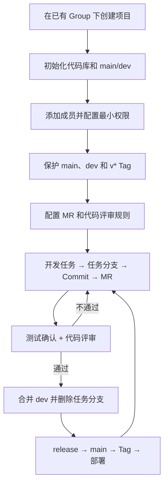

# 中科融道基于 GitLab 的项目开发管理规范

## 1. 适用范围

本文档面向开发经理和项目负责人，规定新项目如何在公司已有 GitLab Group 下完成项目创建、成员配置、代码库初始化、开发过程管控和版本发布。

配套文档：

- [`GIT_WORKFLOW.md`](./GIT_WORKFLOW.md)：分支、合并、发布和热修复规范。
- [`GITLAB_TRAINING.md`](./GITLAB_TRAINING.md)：Git 本地仓库与远程协作基础。

核心流程：



## 2. 在已有 Group 下创建项目

开发经理进入公司指定 Group，在 GitLab 中操作：

```text
Group 页面
→ New project
→ Create blank project
```

配置：

| 配置项 | 推荐值 |
|---|---|
| Project name | 清晰的项目英文名称，例如 `workticket-generation` |
| Project slug | 小写英文、数字和短横线 |
| Namespace | 必须选择公司指定 Group/Subgroup |
| Visibility | 一般选择 Private |
| Initialize repository with a README | 新项目建议勾选 |

禁止把正式项目建在个人 Namespace。

创建完成后进入：

```text
Settings → General
```

检查项目名称、描述、Visibility，以及 Repository、Merge Request、Tag、Release 等代码管理功能是否启用。

官方参考：[Create a project](https://docs.gitlab.com/user/project/)。

## 3. 初始化代码库

### 3.1 提交基础文件

项目初始版本至少包含：

```text
README.md
VERSION
.gitignore
.env.example
CHANGELOG.md
源码目录
tests/
依赖声明及锁文件
Dockerfile / Compose（如适用）
docs/
```

`README.md` 至少说明项目用途、技术栈、本地启动方法、测试命令、负责人和文档入口。

根目录 `VERSION` 作为系统发布版本的统一来源，初始内容建议为：

```text
0.1.0
```

版本号采用 `MAJOR.MINOR.PATCH` 格式，`VERSION` 文件中不加 `v`；正式 Git Tag 使用 `v0.1.0`。

同一个系统仓库中的后端、前端、Docker 镜像、Git Tag 和 Release 应保持版本一致：

```text
VERSION                  0.1.0
后端版本                  0.1.0
前端版本                  0.1.0
Docker 镜像              project-backend:0.1.0
Git Tag                  v0.1.0
GitLab Release           v0.1.0
```

版本升级应在 release 分支中完成，并在同一个 MR 中更新 `VERSION`、依赖或应用版本文件及 `CHANGELOG.md`。评审时必须检查不同位置的版本号是否一致。

真实 `.env`、密码、Token、日志、缓存、数据库备份和构建产物不得提交。

### 3.2 建立 `main` 和 `dev`

- `main`：已发布或随时可发布的稳定代码。
- `dev`：日常开发集成代码。

创建 `dev`：

```bash
git clone <项目 SSH 地址>
cd <项目目录>
git switch main
git pull --ff-only origin main
git switch -c dev
git push -u origin dev
```

日常功能合入 `dev`，正式版本通过 release 分支合入 `main`。

## 4. 配置成员和权限

进入：

```text
Manage → Members
```

按最小权限分配：

| 人员 | 推荐角色 | 说明 |
|---|---|---|
| 开发经理/技术负责人 | Maintainer | 管理项目、成员、分支、MR 和发布 |
| 普通开发人员 | Developer | Push 任务分支、创建和维护 MR |
| 测试或只读人员 | Reporter | 查看代码、Commit、分支、MR 和 Tag |
| 临时协作人员 | 按实际最低角色 | 必须设置访问到期时间 |

项目人员通常从已有 Group 继承权限；只有项目特有或临时人员才直接添加到项目。

开发经理应检查成员的直接权限和 Group 继承权限，最终权限以最高角色为准。不要为了方便把所有成员设为 Maintainer。

人员离开项目时立即：

- 移除项目或 Group 权限。
- 吊销相关 Token、Deploy Key 和部署权限。
- 转交未完成开发任务和 MR。
- 更换其接触过的共享密钥。

官方参考：[Project members](https://docs.gitlab.com/user/project/members/)、[Roles and permissions](https://docs.gitlab.com/user/permissions/)。

## 5. 配置分支和 Tag 保护

进入：

```text
Settings → Repository → Branch rules
```

### 5.1 `main`

| 配置 | 推荐值 |
|---|---|
| Allowed to push and merge | No one |
| Allowed to merge | Maintainers |
| Allow force push | 关闭 |

### 5.2 `dev`

| 配置 | 推荐值 |
|---|---|
| Allowed to push and merge | No one |
| Allowed to merge | Maintainers；流程稳定后可调整为 Developers + Maintainers |
| Allow force push | 关闭 |

必须明确设置 `Allowed to push and merge = No one`，禁止直接 Push；所有代码通过 MR 合入。

### 5.3 正式 Tag

进入：

```text
Settings → Repository → Protected tags
```

配置：

```text
Tag pattern：v*
Allowed to create：Maintainers
```

只有发布负责人或 Maintainer 可以创建正式版本 Tag。

官方参考：[Protected branches](https://docs.gitlab.com/user/project/repository/branches/protected/)、[Protected tags](https://docs.gitlab.com/user/project/protected_tags/)。

## 6. 配置 MR 和代码评审规则

### 6.1 MR 合并条件

进入：

```text
Settings → Merge requests
```

启用或要求：

- All discussions must be resolved（版本提供时）。
- 普通 MR 至少 1 人评审。
- 数据库、鉴权、安全和部署变更由对应负责人评审。
- `release/*` 和 `hotfix/*` 进入 `main` 由开发经理审批。
- 作者不能作为自己 MR 的唯一审批人。

GitLab Free 的 Approval 可能不能形成强制门禁；此时通过保护分支并只允许 Maintainer 合并进行补充控制。Required Approvals 等能力取决于 GitLab 授权等级。

官方参考：[Merge request approvals](https://docs.gitlab.com/user/project/merge_requests/approvals/)。

### 6.2 MR 模板

创建：

```text
.gitlab/merge_request_templates/Default.md
```

模板至少包含：

```markdown
## 任务来源

填写公司内部任务编号、需求单或工作安排。

## 修改内容

- 修改一

## 测试结果

- [ ] 相关测试通过
- [ ] 手工核心流程通过

## 影响和风险

- 数据库变更：无/有
- 配置变更：无/有
- 回滚方式：说明
```

### 6.3 在 GitLab 上指定评审人

MR 创建后，由 MR 作者或开发经理在 MR 右侧边栏的 **Reviewers** 中指定评审人。

- **Assignee**：负责推动 MR 完成的人，通常是 MR 作者。
- **Reviewer**：负责检查代码并给出评审结论的人。
- 普通改动至少指定 1 名熟悉相关模块的评审人。
- 数据库、权限、安全、公共组件等高风险改动，应增加对应负责人参与评审。
- MR 作者不能作为自己 MR 的唯一评审人。

评审人可从 GitLab 顶部的 **Review requested**，或项目的 **Code → Merge requests** 中找到待评审 MR。

### 6.4 评审人的操作步骤

#### 6.4.1 先检查 MR 基本信息

进入 MR 的 **Overview** 页面，确认：

- 标题和任务来源清楚。
- 源分支、目标分支正确，例如 `feature/* → dev`。
- 修改内容、测试结果、风险和回滚方式已填写。
- MR 不包含与本任务无关的代码。
- Commit 数量和说明基本合理。

如果基本信息不完整，应先要求作者补充，再继续详细评审。

#### 6.4.2 在 Changes 中逐文件检查

进入 MR 的 **Changes** 页面，按文件查看代码差异，重点检查：

- 功能实现是否符合任务目标和验收标准。
- 修改范围是否最小，是否误改或漏改文件。
- 正常流程、边界条件和异常情况是否处理。
- 是否可能影响现有功能或兼容性。
- 是否存在明文密码、密钥、个人信息或敏感日志。
- 数据库、配置、接口和部署影响是否已说明。
- 代码命名、结构、重复逻辑和可维护性是否合理。
- 作者填写的测试内容是否能够覆盖主要风险。

#### 6.4.3 对具体代码发起讨论

发现问题时，点击对应代码行旁的评论图标，在具体代码行上留言。

建议一条讨论只描述一个问题，并使用统一标记：

- `[必须修改]`：功能错误、安全风险、明显缺陷或违反规范，修改后才能合并。
- `[建议修改]`：建议优化，不一定阻止本次合并。
- `[疑问]`：需要作者解释设计目的或业务逻辑。

评论应说明“问题是什么、可能造成什么影响、建议如何处理”，避免只写“这里不对”“需要优化”。有明确替代代码时，可以使用 GitLab 的 **Suggestion** 提交修改建议，作者可以直接应用建议。

问题较少时可以选择 **Add comment now** 立即发布；需要完整看完后统一提交时，先选择 **Start a review**，后续评论选择 **Add to review**，最后从 **Your review** 一次性提交。

#### 6.4.4 提交评审结论

完成检查后，在 **Your review** 中提交评审结论：

- **Approve**：没有阻止合并的问题，可以合并。
- **Comment**：只提交评论，暂不批准，也不明确阻止合并。
- **Request changes**：存在必须修改的问题，要求作者修改后重新评审；该能力和强制效果取决于 GitLab 版本及授权等级。

如果当前 GitLab 不提供 **Request changes**，评审人应保留 `[必须修改]` 讨论为未解决状态，不要点击 **Approve**。开发经理或 Maintainer 不得在未解决讨论存在时合并。

### 6.5 MR 作者处理评审意见

MR 作者收到意见后：

1. 逐条阅读并回复，存在理解分歧时先讨论，不直接忽略。
2. 在原任务分支修改代码并完成本地测试。
3. `commit` 后执行 `git push`；MR 会自动显示新的 Commit 和 Diff。
4. 在对应讨论中说明处理结果；不能修改的意见应说明原因并取得评审人认可。
5. 修改完成后，在 **Reviewers** 区域重新请求评审。

示例：

```bash
git switch feature/123-history-search
# 修改并测试代码
git add <本次修改文件>
git commit -m "fix(history): 处理空查询条件"
git push
```

原则上由提出问题的评审人确认修改有效后关闭对应讨论；作者不应在未说明处理结果的情况下自行批量关闭讨论。

### 6.6 复审、批准和合并

评审人收到重新评审通知后：

1. 查看作者的新回复和新 Commit。
2. 检查每条 `[必须修改]` 是否真正解决。
3. 确认修改没有引入新的问题。
4. 关闭已经解决的讨论。
5. 没有阻止项后点击 **Approve**。

最终由 Maintainer 合并前再次确认：

- MR 不是 Draft 状态，目标分支正确。
- 必要评审人已经批准。
- 所有必须修改项和讨论均已解决。
- 测试结果已填写且无代码冲突。
- 合并后选择删除源分支。

一个完整的评审闭环是：

```text
作者创建 MR并指定 Reviewer
        ↓
评审人查看 Overview 和 Changes
        ↓
逐行评论并提交评审结论
        ↓
作者修改、测试、Commit、Push
        ↓
评审人复审、关闭讨论、Approve
        ↓
Maintainer 检查合并条件并 Merge
        ↓
删除任务分支
```

官方参考：[Merge request reviews](https://docs.gitlab.com/user/project/merge_requests/reviews/)、[Review suggestions](https://docs.gitlab.com/user/project/merge_requests/reviews/suggestions/)、[Merge request approvals](https://docs.gitlab.com/user/project/merge_requests/approvals/)。

## 7. 项目开发工作流程

### 7.1 所有开发必须有明确任务

开发任务可以来自公司内部需求单、工作任务或项目计划，至少应明确：

- 背景和目标。
- 开发范围。
- 验收标准。
- 负责人和优先级。
- 计划完成时间。

### 7.2 从 `dev` 创建任务分支

| 类型 | 格式 | 示例 |
|---|---|---|
| 新功能 | `feature/<task-id>-<name>` | `feature/123-history-search` |
| 普通修复 | `fix/<task-id>-<name>` | `fix/145-log-mask` |
| 发布 | `release/vX.Y.Z` | `release/v0.2.0` |
| 热修复 | `hotfix/vX.Y.Z` | `hotfix/v0.2.1` |

开发人员执行：

```bash
git fetch origin
git switch dev
git pull --ff-only origin dev
git switch -c feature/123-history-search
git push -u origin feature/123-history-search
```

### 7.3 开发和提交

```bash
git status
git diff
git add <本任务相关文件>
git diff --staged
git commit -m "feat(history): 增加历史票查询"
git push
```

Commit 必须说明修改目的，不使用 `update`、`修改代码`、`最终版` 等模糊说明。

### 7.4 创建 MR

```text
feature/* 或 fix/* → dev
```

MR 作者负责：

- 填写任务来源或内部任务编号。
- 填写修改、测试、风险和回滚说明。
- 确认 Diff 只包含当前任务。
- 处理测试问题、评审意见和代码冲突。

### 7.5 评审和合并

评审人检查：

- 功能是否符合任务要求和验收标准。
- 是否影响已有功能。
- 边界、异常和安全是否处理。
- 测试是否覆盖主要风险。
- 数据库、配置和部署影响是否明确。

满足以下条件后才能合并：

- 相关测试完成并记录结果。
- 评审通过。
- 所有讨论已解决。
- 无代码冲突。
- MR 目标分支正确。

合并后删除远程任务分支，并更新公司内部任务状态。

## 8. 开发过程管控

开发经理重点检查：

### 8.1 每日

- 高优先级开发任务是否有负责人。
- MR 是否无人评审或长期等待。
- 是否出现直接 Push 保护分支的尝试。
- 是否有阻塞任务或敏感文件误提交风险。

### 8.2 每周

- 当前迭代完成情况。
- 长期未更新的任务分支和 Draft MR。
- 反复失败或不稳定测试。
- 数据库、配置、部署等高风险 MR 是否经过专项评审。
- 项目成员权限和临时人员到期时间。

### 8.3 重点变更

以下变化必须在 MR 中明确说明，并由对应负责人评审：

| 变化 | 管控要求 |
|---|---|
| 数据库结构 | 必须有 migration、历史数据影响和恢复方案 |
| 配置项 | 同时更新 `.env.example` 和部署文档 |
| 依赖版本 | 说明升级原因、兼容性和锁文件变化 |
| 构建/部署 | 由开发经理或运维负责人评审 |
| 鉴权、安全、日志 | 由技术负责人重点评审 |

真实 `.env`、Token、私钥、生产数据、日志、缓存和发布压缩包不得提交到源码仓库。

## 9. 版本发布

### 9.1 创建发布分支

从 `dev` 创建：

```text
release/vX.Y.Z
```

进入发布阶段后：

- 冻结新功能。
- 只修复阻断发布的问题。
- 更新 `VERSION`、应用版本文件和 `CHANGELOG.md`。
- 执行完整测试和构建。
- 确认数据库、配置、备份和回滚方案。

### 9.2 合并、Tag 和部署

```text
release/vX.Y.Z
→ MR 到 main
→ 测试和审批通过
→ 合并 main
→ 创建 vX.Y.Z Tag
→ 构建不可变制品
→ 部署生产
→ 冒烟测试和监控
```

制品使用明确版本，例如：

```text
workticket-backend:0.2.0
workticket-frontend:0.2.0
```

禁止仅依赖 `latest` 判断生产版本。

### 9.3 修复回流和分支清理

发布分支中的修复必须合回 `dev`。确认 `main` 和 `dev` 都包含发布修复后，删除 release 分支。

### 9.4 生产热修复

```text
main / 当前生产 Tag
→ hotfix/vX.Y.Z
→ 最小修改、测试和审批
→ 合入 main 并创建新 Tag
→ 部署生产
→ 同一修复合入 dev
→ 删除 hotfix 分支
```

## 10. 开发经理初始化检查清单

### 项目和代码库

- [ ] 项目创建在正确的已有 Group/Subgroup 下。
- [ ] 名称、Slug、Description 和 Visibility 正确。
- [ ] `main`、`dev` 和基础文件已初始化。
- [ ] README、`VERSION`、`.gitignore`、`.env.example` 和测试代码已提交。

### 成员和权限

- [ ] 开发经理为 Maintainer。
- [ ] 普通开发人员为 Developer。
- [ ] 测试或只读人员为 Reporter。
- [ ] 临时人员设置了到期时间。
- [ ] 没有无必要的 Maintainer 权限。

### 分支和 MR

- [ ] `main`、`dev` 禁止直接 Push 和 Force Push。
- [ ] `v*` Tag 仅 Maintainer 创建。
- [ ] MR 评审和审批规则已明确。
- [ ] MR 模板已提交。

### 开发和发布

- [ ] 任务、分支、Commit 和 MR 规则已明确。
- [ ] 数据库、配置、依赖和部署变更有专项评审人。
- [ ] 版本号、Tag、构建、部署和回滚流程已明确。

## 11. 核心管控原则

```text
项目必须建在公司 Group；
成员权限遵循最小原则；
main、dev 禁止直接 Push；
所有开发必须有明确任务；
所有修改必须使用任务分支；
所有合并必须经过 MR；
所有 MR 必须完成测试和评审；
正式发布必须有唯一 Tag；
部署制品必须使用明确版本；
人员、权限和长期分支必须定期清理。
```
